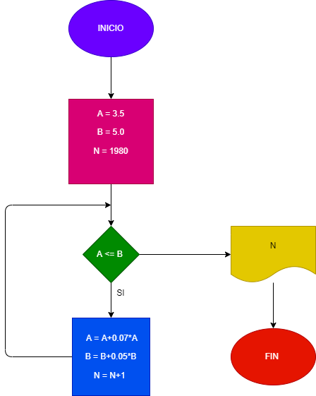

# EJERCICION No. 27

# En 1980 la ciudad A tenia 3.5 millones de habitantes y una taza de crecimiento del 7% anual; y la ciudad B 5 millones y una taza del crecimiento del 5% anual. Si el crecimiento poblacional se mantiene constante en las 2 ciudades, hacer el diagrama de flujo y el programa en python que calcule e imprima en que año la poblacion en la ciudad A es mayor que la ciudad B.

## Diagrama de flujo 
